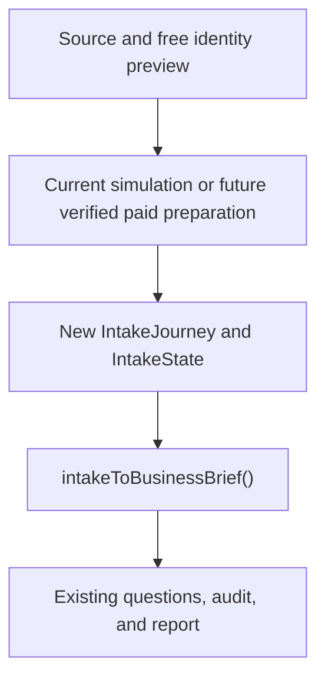

# NUAVE — Clean Rebuild Plan for the Airbnb-Inspired Business Intake

**Status:** Revision 3, draft for final narrow closure check

**Date:** 2026-09-03

**Repository:** `/Users/yasir/nuave_v0.2`

**Purpose:** Replace the customer-facing legacy/hybrid business intake with one coherent, Airbnb-inspired intake journey while preserving safe downstream capabilities where they remain suitable.

This document is an implementation plan, not authorization to merge, deploy, make paid-provider calls, or change production. Revision 2 was checked against `origin/main` at `e531ff4653c324007eb049bee93f2a3b922cf216`; Revision 3 incorporates the narrow closure check of plan commit `c8eadaba0ca674ed1ce615a1826c0392f879f18f`. Revision 3 does not claim that the repository baseline was refreshed. Before implementation, the executing agent must refresh it, read `AGENTS.md`, inspect the current repository and branch, and revise this draft if later code invalidates a load-bearing assumption.

---

## 1. Decision and authority

The previous instruction to **extend rather than replace the existing intake** is explicitly superseded.

The new direction is:

1. Archive and freeze the legacy intake experience and its per-screen old/new switching mechanism.
2. Build a new intake journey as an isolated customer-facing surface from the ground up.
3. Treat the approved Airbnb prototype as the experience authority for the complete journey, not as a catalog of reusable components.
4. Let the intake-facing model, supporting schemas, persistence, and integration code adapt to that experience. Do not make the experience mirror the old `BusinessBrief` fields or old renderers.
5. Preserve source retrieval, payment verification, paid preparation, question generation/review, audit execution, and reporting when they satisfy the locked product contract. Integrate them through explicit boundaries.
6. Use one small, pure, one-way `intakeToBusinessBrief()` mapper unless repository inspection proves that the downstream contract itself must be versioned.
7. Require explicit founder approval at every material customer-experience gate.

Use this hierarchy when requirements conflict:

> **Customer experience → product behavior → technical correctness → implementation convenience**

Security, payment authority, privacy, and the locked product promise remain hard constraints. Within those constraints, existing code, schemas, tests, and migration convenience must adapt to the intended experience—not the other way around.

### Authority order

1. Safety, legal, privacy, and server-authoritative payment boundaries.
2. The latest explicit founder decision that clearly states its scope and supersedes an earlier product or experience decision, including decisions recorded at the UX gates in this plan.
3. The locked V1 product contract for behavior not explicitly superseded.
4. The approved Airbnb intake prototype and its experience invariants.
5. New intake architecture and data contracts.
6. Existing backend contracts and implementation, where compatible.
7. Legacy intake implementation and tests, for dependency discovery and rollback only.

Phase 0 must sweep every intake-relevant canonical document named by `docs/INDEX.md`, plus the approved prototype and its handoff artifacts, for conflicts affecting behavior, copy, or customer-visible states. Record each conflict, the applicable authority above, and its resolution. Do not silently choose between documents at the same authority level; an unclear same-level conflict blocks only the affected decision and returns to Yasir.

The legacy intake is **not** a design reference. An agent may inspect it to identify APIs, persistence, state transitions, and downstream dependencies, but may not copy its screen hierarchy, form composition, internal vocabulary, navigation, or validation presentation into the new experience.

### Verified repository facts at Revision 2

- `src/app/audit/v2/AuditV2Journey.tsx` currently owns the whole pre-payment versus post-payment boundary and renders `<AuditWorkflow />` after the simulated-paid handoff.
- `AuditWorkflow.tsx` currently owns browser restore/persistence, extraction, the editable `BusinessBrief`, intake navigation, prompt generation/editing, audit execution, report generation, and variance. Narrowing this controller is therefore a first-class migration, not incidental wiring.
- The current workflow record is `nuave.audit.workflow.v9`; it persists `brief`, `meta`, extraction, question pack, observations, and report together in `sessionStorage`.
- `BusinessBrief` and `ExtractionDraft` are defined in `src/lib/audit/types.ts`; `INTAKE_SCREENS`, `FIELD_OWNERSHIP`, validation, and screen navigation are in `workflow-authority.ts`.
- The approved prototype is tracked at repository root as `intake-prototype.html`. Its dynamic post-payment path has up to 11 screens including question review, with branch/product conditionals.
- No `PREVIEW_INTAKE_SURFACE` or `/audit/v2/intake-preview` implementation exists on current `main`. The per-screen fallback exists as a proposal in the unmerged remote branch `origin/claude/nuave-intake-recovery-plan-tlv905`; the tested hybrid implementation was not pushed. Archive that branch/any local implementation as evidence, but do not forward-port its flag into the rebuild.
- `docs/V1_PRODUCT_CONTRACT.md` says provenance and confidence remain hidden, while `docs/VOICE.md` section 7.2 still mandates visible provenance labels. The newest founder decision is to hide them. That canonical conflict must be reconciled before an implementation specification is approved.

### Forensic: why cycles 1 and 2 failed

This diagnosis is a prerequisite for the controls below. It is not another broad review.

| Cycle | Observed mechanism | Customer consequence |
| --- | --- | --- |
| **1: Spec 007 implementation** | Package E1 carried all experience requirements at the end of a large technical sequence. It built the pre-payment surface separately, then routed post-payment into the existing `AuditWorkflow` and extended the old `AuditStages` form. `BusinessBrief`, legacy renderers, and UI-pinning tests remained the path of least resistance. No owner or gate judged the composed experience before the final integration. | The workflow was technically correct and end-to-end, but the approved interaction model was reduced to progressive form screens. Internal vocabulary, duplicate hierarchy, and old input patterns remained. |
| **2: recovery plan and local implementation** | The recovery plan made migration reversible through `PREVIEW_INTAKE_SURFACE`, choosing old or new rendering independently per screen. Gate 1 reviewed a partial journey whose unconverted screens deliberately fell through to legacy UI. Review rewarded safe incrementality without challenging whether a mixed journey was reviewable. | The customer encountered two products in one flow: duplicate Back/progress/heading systems and alternating tap-first versus form-first interactions. The inconsistency was structural, not a missing-polish defect. |

The contributing mechanisms were: wrong migration unit (screen rather than whole journey), controller dominance, direct UI coupling to `BusinessBrief`, tests that protected legacy widgets, experience responsibility deferred to the final package, no daily experience owner, and no full rendered walkthrough early enough to change direction cheaply. Deadline pressure was not recorded as evidence and is not asserted as a cause; the Phase 0 checkpoint must add it only if repository history or participants substantiate it.

### Cause-to-control map

| Named failure mechanism | Control in this plan | Required proof |
| --- | --- | --- |
| Per-screen migration created a hybrid journey | One isolated `IntakeJourney`; whole-journey cutover only | Import/route guard plus full sequential screenshot gallery |
| `AuditWorkflow` dominated screen/state decisions | State-ownership map and explicit controller decision before UI construction | Recorded boundary decision and contract test at the handoff |
| `BusinessBrief` shaped the interface | Experience-native `IntakeState`; paper mapping spike before Gate 0 | Completed mapping table with every loss/unmapped concept visible |
| Legacy widget tests made replacement expensive | Quarantine legacy UI tests; add outcome and experience-contract tests | Both suites run against their named journeys until cleanup |
| Experience was deferred to final integration | Complete fixture skeleton before integration | Founder Gate 1 verdict on the whole path |
| Nobody owned continuous fidelity | One named Intake Experience Owner with veto | Owner named in the execution brief and every customer-touchpoint PR signed off |
| CI could not see visual/linguistic drift | Copy deck, closed archetypes, real-shaped fixtures, screenshot walkthrough | Founder gates plus approved screenshot baseline after Gate 1 |
| Persistent state and controller had overlapping ownership | One mutable `IntakeState` authority and immutable derived handoffs | Field-to-writer/readers/resume map plus restoration tests |

---

## 2. Locked product behavior to preserve

Do not reopen these decisions without a concrete technical, security, or legal blocker:

- The experience is source-first and mobile-first.
- The free identity preview confirms that Nuave found the correct business; it does not produce personalized audit findings.
- In the target paid product, payment must be server-authoritatively verified before personalized enrichment/preparation. The current Spec 007 simulated-success handoff sequences the fixture journey only and must not be described as a security or entitlement boundary.
- One verified order owns one current preparation job and draft version. Reload, reconnect, or duplicate navigation must return that job rather than start another.
- Intake is an evidence-first correction loop: Nuave drafts; the customer confirms, corrects, or adds what is missing.
- The UI does not need to mirror the engine schema, and one interaction may populate several downstream fields.
- Missing noncritical information must not block progress.
- Provenance, confidence, timestamps, and internal technical metadata remain hidden from customers.
- There is no audit-priority screen and no conversion-action screen.
- Full Google Maps intake and advanced competitor resolution remain deferred.
- The customer sees a final editable intake review before audit questions are generated.
- The audit contains exactly 10 reviewed questions: 6 unbranded and 4 branded.
- Being mentioned is not equivalent to being recommended; a branded answer is not evidence of spontaneous discovery.
- After material business facts change, generated questions become stale and must be regenerated and reviewed again.
- The customer explicitly confirms before the audit runs.

### Revision 3 release scope

This rebuild delivers the complete new intake journey on Nuave's **current simulated-payment product path**. It does not implement real payment, a production order service, server-owned paid intake storage, or cross-device paid resume. Those capabilities are separate paid-launch prerequisites in Section 8 and may not be implied by fixture or browser-only behavior.

The complete composed path delivered by this rebuild is:

```text
Source → Free identity preview → Clearly simulated order/payment handoff
→ Preparation → New intake journey → Final intake review
→ Generate 10 questions → Question review → Explicit run confirmation
→ Audit → Report
```

The later paid-launch target is:

```text
Source → Free identity preview → Order/payment → Verified paid preparation
→ New intake journey → Final intake review → Generate 10 questions
→ Question review → Explicit run confirmation → Audit → Report
```

The intake rebuild owns the new intake surface and the correctness of its handoffs. Source, preview, payment, question review, audit, and report may remain existing surfaces, but their transitions into and out of the intake must be validated as one journey.

---

## 3. Experience contract

Before writing production integration code, convert the approved prototype into a short, binding experience contract. It must describe the experience properties below and include a canonical screen/transition ledger derived directly from the prototype.

### Binding experience invariants

- One coherent shell across the entire intake.
- One progress model, one Back action, and one primary Continue action.
- One clear mental question or decision per screen.
- Customer-language headings; no backend field names or implementation vocabulary.
- Read/recognize/confirm before edit; typing is a fallback, not the default interaction.
- Prepared recommendations or choices where evidence supports them.
- Every drafted answer is correctable.
- Progressive disclosure: advanced or optional detail does not dominate the main path.
- Calm pacing, predictable transitions, and consistent content hierarchy.
- Mobile is the primary acceptance viewport; desktop remains fully usable.
- The final readback represents the meaning of everything confirmed, not a dump of engine fields.
- Empty, loading, retry, validation, and recovery states use the same shell and interaction grammar.

### Prototype deviation rule

A deviation from the prototype is permitted only when required by a locked product rule, safety boundary, accessibility need, or demonstrated technical limitation. Every deviation must record:

1. what differs;
2. why it must differ;
3. which underlying experience invariant the prototype carried; and
4. how the new treatment preserves that invariant another way.

“The existing schema/component/test works differently” is not an acceptable reason.

### Required artifact: screen and transition ledger

For every screen/state in the prototype, record:

- customer purpose;
- entry condition;
- information shown;
- available customer actions;
- validation/blocking behavior;
- Back behavior;
- Continue behavior;
- next screen/branch;
- empty/loading/error variation;
- mobile and desktop expectations;
- intentional deviation, if any.

This ledger—not the legacy screen order—defines the new journey controller.

---

## 4. Target architecture



### 4.1 New `IntakeJourney`

An isolated module owns:

- the complete intake shell;
- canonical screen order and conditional branches;
- Back/Continue behavior;
- per-screen validation presentation;
- focus and scroll restoration after transitions;
- intake progress;
- intake-specific loading, empty, error, and retry states;
- final intake readback; and
- the handoff of confirmed intake state to the mapper.

It must not import or fall through to legacy intake renderers. Unfinished screens on the development route use purpose-built fixture placeholders inside the new shell; they never render the old form.

### 4.2 New `IntakeState`

Create the smallest concrete data model that naturally represents the approved experience. It may contain:

- prepared values and suggested alternatives;
- the customer’s selected or edited value;
- confirmed/corrected/unanswered state where the interaction needs it;
- optional versus blocking status;
- information needed for screen order and progress; and
- hidden evidence/provenance references where downstream safety requires them.

Do not build a general-purpose dynamic form engine, universal field registry, event bus, or schema framework. Prefer explicit fields and small types that correspond to the actual intake experience.

Technical metadata may exist in state but must not automatically become visible UI.

`IntakeState` is the sole mutable authority while the customer is in intake. Screens never keep an independently editable `BusinessBrief`. The state-ownership artifact must list every field, its only writer, its readers, its persistence owner, and its resume behavior before the shell is built.

### 4.3 Small one-way mapper

Implement one authoritative, pure boundary:

```ts
intakeToBusinessBrief(confirmedIntake): BusinessBrief
```

The mapper may normalize, combine, derive, default, and rename fields. It must:

- have no rendering;
- make no network or AI calls;
- own no navigation or persistence;
- contain no payment logic;
- be deterministic for the same input;
- validate its output against the downstream contract;
- report mapping failures explicitly; and
- have focused unit/contract tests.

Do not introduce a generic adapter framework or bidirectional synchronization. The intake owns `IntakeState`. At confirmation, the mapper derives an immutable `BusinessBrief` snapshot tied to the confirmed business-fact version. Downstream stages may persist and consume that snapshot, but never edit it or synchronize it back into `IntakeState`. If intake changes before audit start, create a new fact version and derive a new snapshot.

### 4.4 `BusinessBrief` and downstream contracts

`BusinessBrief` remains the default compatibility contract for question generation and audit execution, but it is not a UI model and has no authority over screen composition.

Prove mapper feasibility on paper before Founder UX Gate 0. Create an explicit mapping table from the complete prototype ledger, not merely the happy-path fields:

| Intake concept | `BusinessBrief` destination | Transformation/default | Lossless? | Downstream consumer |
| --- | --- | --- | --- | --- |

If an experience concept cannot be represented without lossy, misleading, or brittle mapping:

1. do not distort the UI;
2. document the mismatch;
3. inspect every downstream consumer; and
4. version or adjust the downstream schema with the smallest coherent migration.

Schema changes are allowed when genuinely required by the product experience. They must be deliberate and tested, not incidental edits distributed among screens.

The mapping spike must end with one of three recorded outcomes for every intake concept: **lossless mapping**, **intentional derived/defaulted mapping**, or **downstream contract change required**. Gate 0 cannot approve a composition whose data meaning is still unknown.

### 4.5 Material changes and question invalidation

Use the normalized mapper output, not keystrokes, to decide materiality.

| Change | Material? | Effect |
| --- | --- | --- |
| Any normalized field consumed by question generation or identity/comparison policy changes | Yes | New business-fact version; derive a new immutable brief; supersede the complete question pack; regenerate and re-review before audit start |
| Official identity/scope/source changes while still representing the same purchased business | Yes | Reconfirm identity and follow the same invalidation rule |
| UI-only state such as current screen, expansion, focus, local draft before save, or choice ordering | No | Persist UI state as needed; keep the current fact and question versions |
| Whitespace/case/punctuation edit that normalizes to the identical mapper output | No | No question regeneration |
| Any attempted fact change after audit start | Not permitted on the active run | Preserve frozen brief, questions, and evidence; use the existing correction/remedy path |

One confirmed fact version may create at most one model-generated question pack; retries return the same job/result and do not spend again. Question preparation does not consume the audit entitlement. Before real payment launches, the founder must approve the maximum number of customer-created fact versions/model generations per order and the customer remedy after that ceiling. Until that decision, tests and previews use deterministic fixtures/fallbacks and make no paid call.

### 4.6 Recorded `AuditWorkflow` decision

The architectural decision is **new intake-owned controller, observed at one boundary by a narrowed `AuditWorkflow`**. `AuditWorkflow` may remain the macro coordinator, but it must not own the new screen graph, editable intake state, or intake persistence.

The implementation spike must choose the smallest code shape that enforces this decision, for example extracting a downstream workflow component or adding one completion boundary. It may not preserve the current ownership merely because moving it is difficult. After the split, `AuditWorkflow` is limited to responsibilities such as:

- accepting the completed `BusinessBrief`;
- persisting/restoring the larger audit workflow;
- generating and reviewing questions;
- explicit audit start;
- audit execution; and
- report/variance flow.

It observes one event/record from intake: a confirmed fact version plus its derived immutable `BusinessBrief`. It does not receive per-screen updates. If the spike shows this cannot be achieved without duplicating orchestration or creating two mutable authorities, stop and revise the plan before any customer-facing shell work.

### 4.7 Persistence decision

Do not decompose, convert, or migrate `nuave.audit.workflow.v9` in place. It remains owned by and accessible only to the complete legacy journey while legacy entries drain.

For the current simulated rebuild, create two new versioned `sessionStorage` records:

- `nuave.audit.intake.v1`, written only by `IntakeJourney`, contains mutable `IntakeState` and its current screen/version; and
- `nuave.audit.workflow.v10`, written only by the narrowed macro/downstream workflow, contains preparation handoff/status, the immutable confirmed `BusinessBrief` snapshot, and question, audit, and report state.

The completion handoff may copy an immutable derived snapshot from the intake record into the downstream record. It must never copy mutable intake ownership into `AuditWorkflow` or synchronize changes back into `IntakeState`. New simulated entries use the new records; existing `v9` entries remain on the legacy journey. There is no cross-version coercion or state translation.

These `sessionStorage` records must support truthful refresh and revisit behavior within the same browser session, but they remain non-durable. The simulated route must not claim persistence after that session, paid durability, or cross-device resume.

Before real payment launches, replace the browser persistence implementation behind the same narrow conceptual boundary with server-owned versioned intake state keyed to a verified order. The browser then stores only an opaque order/session pointer plus a disposable cache. Clearing browser storage must not destroy paid preparation or confirmed work, and an authorized customer must be able to resume on another device. Real-payment cutover is blocked until that server-owned contract is implemented and verified.

Define one narrow persistence boundary, not a framework, covering:

- current screen and chapter;
- confirmed intake values;
- preparation status;
- current simulated journey/session and state version, with a future verified-order owner at paid launch;
- generated-question version or invalidation state;
- refresh/revisit restoration;
- stale/incompatible state behavior; and
- clean handoff to later audit stages.

Do not coerce old saved intake state into the new UI. This rebuild provides no `v9` migration: a `v9` entry stays on the complete legacy journey, while a deliberate restart creates new-version state with a clear simulation-safe explanation.

### 4.8 Cutover boundary

The only allowed experience switch selects the whole journey:

```text
legacy journey OR new journey
```

It must never select renderers per screen. The development preview route always renders the complete new shell. Production remains on the complete legacy journey until the release candidate is approved.

---

## 5. Legacy archival and isolation

Git history should be the canonical archive; do not keep a large duplicate source tree in the production bundle merely for comfort.

Before changing the legacy implementation:

1. Record the exact baseline commit.
2. Retain the existing recovery-plan branch and create a recoverable Git tag or archival branch for the actual implementation baseline according to repository policy. Do not merge the recovery plan to obtain its per-screen flag.
3. Write a short legacy inventory listing screens, renderers, proposed feature flags, tests, styles, routes, state keys, and integration dependencies.
4. Freeze the legacy intake until this rebuild is either cut over or abandoned. No feature or visual work is forward-ported from it. An urgent production safety fix requires a separately reviewed minimal patch; copying its UI pattern into the new journey is never automatic.
5. Identify which old tests protect valid product behavior and which merely pin legacy labels/widgets. Quarantine both groups into a clearly named legacy-only suite; do not delete or rewrite them until cutover.

During the parallel build:

- Keep production on the intact legacy journey.
- Build the new journey in an isolated module and non-production preview entry.
- Prohibit imports from legacy intake presentation into the new module.
- Do not introduce the recovery branch's per-screen old/new flag. If an implementation branch already contains it, remove it from all active new-journey code and retain it only in the archival reference.
- Add an automated architectural assertion that the new journey cannot reference known legacy renderers or per-screen flags.

At cutover:

- switch only at the route/journey boundary;
- route existing in-flight work according to its journey/state version; never migrate a paid in-flight customer by falling through screen by screen;
- keep the complete old journey available for a minimum seven-calendar-day stabilization window and at least three successful founder-supervised new-journey completions, whichever is later; and
- after founder approval, production smoke verification, and that window, delete legacy renderers, any per-screen flags, obsolete styles, and quarantined UI-pinning tests from active source. Recovery remains possible from the archival Git reference.

---

## 6. Delivery sequence, ownership, and working budget

Each phase must leave the repository in a truthful state. Green CI proves technical checks only; it does not prove experience fidelity.

### Continuous experience ownership

Before Phase 2, the execution brief must name one **Intake Experience Owner** for the life of the rebuild. This is one identifiable person or agent session, not “the team.” That owner:

- owns the prototype ledger, copy deck, screen archetypes, and deviation log;
- reviews every customer-facing diff and rendered preview, not only milestone gates;
- may reject a legacy pattern in new styling even when tests pass;
- prevents technical packages from deferring experience to a later package; and
- brings unresolved product choices to Yasir instead of choosing the nearest old pattern.

Yasir remains the final approver at every Founder UX Gate. Semantic/system work and interface work may use separate agents, but neither may overrule the Experience Owner inside the approved experience contract.

### Gate and rework rule

- Every gate ends with an explicit **Approved** or **Changes requested** verdict. The planning target is a founder response within one working day per gate. This is a turnaround assumption, not automatic approval: silence or elapsed time is never approval, and dependent work waits.
- While a gate waits, only work explicitly shown to be independent of the pending decision may continue. Do not build ahead against an unapproved experience assumption merely to protect the schedule.
- Gate 0 and Gate 1 allow at most two bounded rework rounds. A second rejection stops downstream work and returns to the experience contract or architecture decision rather than applying a third cosmetic patch.
- A failure at Gate 2, 3, or 4 returns to the earliest artifact invalidated by the finding. Later approvals do not protect a disproven earlier assumption.
- Every gate package states what is real, mocked, incomplete, and intentionally deferred.

### Working estimates

These are planning ranges for one focused implementation stream, not delivery promises. Independent review, CI queueing, and approved live-provider work are excluded. The implementation budget remains **25–43 focused working days**; calendar planning adds up to five one-working-day founder gate turnarounds. If all five waits are sequential and meet the target, the calendar range is approximately **30–48 working days**. A later response extends calendar duration but never converts silence into approval.

| Phase | Working range | Re-plan trigger |
| --- | ---: | --- |
| 0. Evidence and plan checkpoint | 3–5 working days | A root cause, state owner, or downstream dependency remains unknown |
| 1. Archive and quarantine | 1–2 days | Legacy behavior cannot run independently after test isolation |
| 2. Experience/data proof | 3–5 days | Prototype coverage, copy, mapping, or journey budget is unresolved |
| 3. Controller/state boundary and new storage records | 3–5 days | Split requires duplicate mutable state, `v9` migration, or broad downstream rewrite |
| 4. Complete fixture skeleton | 4–6 days | Normal path exceeds the Gate 0 screen/time budget |
| 5. Real interactions and mapper | 4–7 days | Real-shaped data breaks the approved archetypes or mapping |
| 6. Current simulated preparation/persistence/downstream integration | 4–7 days | New-version browser state cannot restore safely or the paid-launch seam is not isolatable |
| 7. Release-candidate hardening | 2–4 days | A customer state lacks deterministic coverage or founder approval |
| 8. Cutover and cleanup | 1–2 days plus stabilization | In-flight work cannot drain or rollback as a whole journey |

Re-plan immediately, rather than consuming the remaining estimate, when any of these occurs: a prototype concept needs lossy mapping; `AuditWorkflow` cannot be narrowed without two authorities; a new customer screen is proposed beyond the approved budget; real prepared data cannot fit the closed archetypes; a founder gate fails twice; or a phase exceeds its upper estimate by more than 50%.

### Phase 0 — Evidence and a plan checkpoint

- Refresh branch, baseline SHA, working-tree status, routes, persistence version, and active flags from current `origin/main`.
- Update the cycle 1–2 forensic only where repository evidence changes it. Map every risk control to a named failure mechanism.
- Run the keep-or-rebuild test on every proposed retained component:
  1. it sits entirely outside intake presentation: an upstream capability emits a versioned preparation/payment record, or a downstream capability consumes the immutable `BusinessBrief` handoff;
  2. it has no knowledge of intake presentation or mutable `IntakeState`;
  3. a contract test can pin its behavior at that upstream or downstream boundary; and
  4. it is not implicated in controller/persistence dominance from cycles 1–2.
- Produce a state-ownership map: field/record → sole writer → readers → persistence location → version → resume behavior.
- Trace `AuditWorkflow`, `workflow-storage`, `workflow-authority`, `AuditV2Journey`, preparation, prompts, questions, run, and report handoffs. Identify the exact seam for the new controller.
- Inspect existing analytics/telemetry for legacy completion, time, step drop-off, validation, correction, and support evidence. Nuave currently has zero paying v2 customers, so record unavailable metrics as unavailable; never fabricate a baseline.
- Establish a comparable internal baseline by walking the legacy journey and the prototype with the same rich, sparse, and corrected fixtures. Record screen count, task completion, elapsed time, validation failures, and places where help was needed.
- Sweep every intake-relevant canonical document named by `docs/INDEX.md`, plus the approved prototype and handoff artifacts, for conflicting behavior, copy, or customer-visible states. Create a conflict register containing the conflicting clauses, authority level, controlling decision, and required canonical edit. Reconcile every conflict that affects Gate 0, including hidden provenance in `V1_PRODUCT_CONTRACT.md` versus visible provenance labels in `VOICE.md`; an unclear same-level conflict returns to Yasir.
- Confirm the Revision 3 scope split: this rebuild targets the current simulated-payment product, while real payment, server-owned paid state, cross-device resume, and paid remedies remain separately blocked paid-launch prerequisites.
- Verify that `nuave.audit.workflow.v9` can remain legacy-only and identify the exact owners and serialization boundaries for new `nuave.audit.intake.v1` and `nuave.audit.workflow.v10` records. Do not plan an in-place `v9` decomposition.
- Verify the recovery-plan branch remains archival evidence only and contains no code that should be forward-ported.

#### Phase 0 checkpoint

The only deliverable is a repository-grounded revision of this plan containing the forensic, state map, keep/rebuild decisions, available baseline evidence, canonical-document conflict register, confirmed simulated-versus-paid scope split, exact storage ownership, exact files in scope, and revised estimates.

Return **Proceed**, **Re-plan**, or **Stop**. No implementation begins from a plan whose load-bearing repository facts failed this checkpoint.

### Phase 1 — Archive legacy and make replacement legal

- Create the archival reference and legacy inventory described in Section 5.
- Freeze legacy presentation and prohibit forward-porting it.
- Quarantine existing legacy UI E2E tests as a legacy-only suite that continues to run against the complete legacy route.
- Keep valid engine/payment/security assertions unchanged or move them into contract suites only when their ownership is clear.
- Create the isolated new module and preview entry with no import from legacy presentation.
- Add a deterministic guard rejecting legacy renderers and any per-screen surface flag in the new module.
- Name the Intake Experience Owner in the execution record.

Do not delete or broadly rewrite legacy UI tests here. They remain evidence until the old journey is removed in Phase 8.

**Exit evidence:** the complete legacy journey and its quarantined tests still pass; the empty new entry cannot fall through to legacy UI; archive and ownership are recorded.

### Phase 2 — Prove the experience and data shape before UI construction

The first task is a prototype coverage audit. Identify every happy, conditional, loading, empty, validation, source-correction, payment-transition, sparse-evidence, manual-fallback, refresh/resume, and failure state the prototype covers or omits. Prototype omissions are design work; they are not permission to reuse legacy screens.

Then produce, as one Gate 0 package:

- the complete screen/transition ledger;
- a closed copy deck in Indonesian, owned by the Intake Experience Owner and checked against `VOICE.md` after the provenance conflict is reconciled;
- a closed set of five screen archetypes:
  1. confirm a prepared fact;
  2. choose one prepared option;
  3. choose several prepared options with additions;
  4. read first, then reveal edit/free-entry fallback; and
  5. readback with correction links;
- a paper `IntakeState` model and complete intake-to-`BusinessBrief` mapping table, including all unmapped/lossy concepts and proposed downstream schema changes;
- the field-level materiality/invalidation table;
- the state-location decision: new versioned `sessionStorage` records for the current simulated rebuild, with server-owned state against a verified order retained as a separate paid-launch prerequisite;
- representative fixtures shaped from captured preparation output: one rich case, at least two deliberately messy real-shaped cases, wrong/ambiguous identity, manual fallback, and preparation failure. Reuse sanitized recorded/test output where possible; do not make a live or paid call without separate authorization;
- a privacy-safe funnel event list: intake started, screen viewed, continued, validation failed, answer corrected, resumed, and completed. Never record entered answer text, public-source content, contact/payment data, or credentials in analytics;
- journey budgets and measurable outcomes.

#### Gate 0 journey budgets

- The normal prototype currently contains no more than 10 post-payment intake screens before question review, or 11 including question review. The approved ledger may preserve or reduce that maximum. Any increase requires Yasir’s explicit approval and a stated reason that cannot be handled through progressive disclosure.
- Phase 0 times the static prototype as an interaction target, not as evidence of real loading or recovery performance.
- Gate 0 approves two separate numeric budgets: **(a)** happy-path active customer time against the prototype under comparable fixture conditions, targeted at no more than 10% slower; and **(b)** total elapsed time for a fixed deterministic recovery script containing one preparation wait and one failed attempt followed by retry. Record active customer time and system wait time separately.
- Measure both budgets on the same fixed fixture scripts at Gates 1 and 4. A fast static dry run cannot satisfy the recovery budget, and variable live-provider latency cannot replace the deterministic comparison.
- Every rich, sparse, and corrected fixture must reach final intake review without developer help or a dead end.
- Correction rate is observed, not optimized downward: corrections can mean the product made uncertainty safely editable.
- Per-screen funnel instrumentation ships with the new preview so post-cutover completion, elapsed time, validation, correction, resume, and drop-off can be compared once real usage exists.

#### Founder UX Gate 0 — Contract, copy, mapping, and budgets

Stop and ask Yasir to approve:

- complete screen sequence and conditional branches;
- screen archetypes and copy deck;
- customer-visible loading/error/recovery behavior;
- every prototype deviation;
- mapping outcomes and any proposed downstream schema change;
- materiality and regeneration behavior;
- current same-browser-session state/resume behavior and the explicitly deferred paid-launch cross-device boundary; and
- numeric screen-count and completion-time budgets.

No customer-facing implementation proceeds with an unmapped concept or unapproved copy/archetype.

### Phase 3 — Establish the controller and state boundary

This is a first-class technical phase, not late integration.

- Implement the recorded decision that `IntakeJourney` owns its screen graph, mutable `IntakeState`, validation presentation, and intake persistence.
- Narrow `AuditWorkflow` so it observes intake only at the immutable confirmed-fact/`BusinessBrief` handoff and continues to own later questions, run, report, and variance behavior where verified.
- Introduce the smallest completion contract and persistence boundary needed by the approved state map.
- Leave `nuave.audit.workflow.v9` unchanged and legacy-only. Introduce new `nuave.audit.intake.v1` and `nuave.audit.workflow.v10` `sessionStorage` records with one writer each, explicit schemas/versions, and no cross-version migration or reverse synchronization.
- Ensure no parent effect can overwrite newer intake-owned state.
- Keep the production legacy route working unchanged while the new path remains non-production.
- Add contract/architecture tests proving one state writer, no legacy imports, no per-screen switching, and no editable `BusinessBrief` inside intake.

Do not build the new screen composition in this phase. If the seam cannot be established without duplicate mutable state or a broad rewrite of downstream behavior, stop and re-plan.

**Exit evidence:** state-ownership map matches code; old journey and its `v9` record stay green; serialization tests prove the two new records have one writer each; a minimal test harness can submit an immutable confirmed fact version to the downstream workflow. The actual parent-remount overwrite regression remains a Phase 5 exit requirement because the interactive state needed to reproduce it does not yet exist here.

### Phase 4 — Build the complete fixture-driven journey skeleton

- Build one shell, progress model, navigation system, and complete approved screen graph.
- Render every normal-path screen and transition with real-shaped fixture data.
- Implement Back/Continue, focus/scroll transitions, basic validation, and the final intake readback.
- Show the transition to question review without connecting prompt generation.
- Emit the approved privacy-safe funnel events.
- Render from the closed archetypes; adding a sixth archetype reopens Gate 0.
- Do not connect live extraction, real payment, production persistence, prompts, or audit execution.

The skeleton must be navigable end to end. No old screen may appear, including as a temporary fallback.

#### Founder UX Gate 1 — Complete normal-path walkthrough

Stop and provide one stable preview, exact scenario instructions, the sequential screenshot gallery, measured screen count, both Gate 0 time budgets, known placeholders, and deviations. Yasir returns **Approved** or **Changes requested** for the complete mobile-first journey; approval of representative components does not count.

### Phase 5 — Implement real interactions, customer states, and mapper

- Implement the approved `IntakeState`, prepared choices, confirmation, correction/edit reveals, optional details, and final readback.
- Implement required versus noncritical validation according to customer meaning.
- Keep provenance/confidence/internal metadata hidden according to the newest founder decision.
- Implement all approved archetypes for rich, two messy, wrong-identity, sparse, manual-fallback, loading, and recovery fixtures.
- Implement the pure `intakeToBusinessBrief()` mapper and validate every mapping/default/schema change from the Gate 0 table.
- Create immutable confirmed fact versions and derived `BusinessBrief` snapshots; never persist two editable copies.
- Implement materiality comparison against normalized mapper output and question-pack invalidation state.
- Add semantic headings, keyboard behavior, focus placement, error association, approximately 44px touch targets, and reduced-motion behavior.
- Add behavior, contract, accessibility, and screenshot tests without pinning ordinary copy as the workflow authority.
- Reproduce the cycle-2 overwrite failure against the new interactive path: create newer intake-owned state, force the parent workflow to remount or restore an older downstream snapshot, and assert that `IntakeState` remains authoritative and unchanged.

**Exit evidence:** all approved interactive fixtures and mapper cases pass, and the parent-remount/restore regression proves that an older parent snapshot cannot overwrite newer intake-owned state.

#### Founder UX Gate 2 — Interactive customer touchpoints

Stop and ask Yasir to validate selecting versus typing, editing drafts, optional/missing information, validation/recovery copy, progress/Back, final readback, both messy fixtures, and mobile pacing. Name every placeholder; “polish later” is not an accepted hidden state.

### Phase 6 — Integrate preparation, persistence, questions, and downstream flow

- Connect personalized preparation only after the approved, clearly simulated handoff for this rebuild. Preserve one explicit entitlement seam so a later paid launch can require server verification without changing the intake controller; do not build the real payment or server-state service in this phase.
- For the simulated journey, enforce one current preparation job per journey/session and draft version; reload/reconnect within that browser session returns it. One job per verified order remains a paid-launch contract, not a simulated proof.
- Initialize `IntakeState` from grounded preparation output without making the preparation schema dictate the UI.
- Connect `nuave.audit.intake.v1` and `nuave.audit.workflow.v10` through the approved one-way handoff. Both remain `sessionStorage`-only and explicitly non-durable in this release.
- Implement pending, retry, manual-ready fallback, sparse evidence, stale state, same-browser-session refresh/revisit, and browser Back behavior. Persistence after that browser session and cross-device resume are not claimed or tested as delivered behavior in this rebuild.
- Submit the immutable derived `BusinessBrief` to existing question generation.
- Preserve exactly 10 questions, 6 unbranded and 4 branded; require review and explicit audit start.
- Regenerate once per new confirmed fact version according to Section 4.5 and never on refresh.
- Preserve verified audit execution, provider, report, and variance behavior unless the Phase 0 keep/rebuild test required a narrow change.
- Verify the complete path with deterministic fixtures/mocks before any separately authorized live test.

#### Founder UX Gate 3 — Real-data-shaped and recovery walkthrough

Stop and ask Yasir to validate successful preparation, both messy cases, pending/failure/retry, same-browser-session refresh/revisit, correction and invalidation, the clearly simulated payment-to-intake transition, question review, and explicit run transition. Paid live-provider calls are excluded unless separately authorized.

### Phase 7 — Release-candidate hardening

- Verify the approved device/browser matrix: 320px minimum-width overflow check; 360×800 Chromium touch; 390×844 WebKit touch; 768×1024 responsive check; and 1440×900 Chromium desktop. Add real-device Safari/Chrome smoke checks when available.
- Verify keyboard and screen-reader fundamentals.
- Verify every customer-visible loading, empty, error, retry, stale, and restoration state.
- Verify duplicate-submit/idempotency protections and question invalidation.
- Produce the sequential screenshot gallery for every fixture.
- Check that no legacy screen, copy, progress element, style, or per-screen flag appears.
- Run the repository’s canonical offline verification, including build and all configured Playwright suites, without live-provider calls.
- Confirm instrumentation contains no answer text or sensitive/payment data.

#### Founder UX Gate 4 — Release candidate

Stop and provide one complete preview covering Source → Preview → payment/preparation simulation → Intake → Final review → 10-question review → Explicit run confirmation. Include the measured happy-path and fixed recovery-path budgets, split into active customer time and system wait time, plus all known limitations. Green CI and earlier screen approvals cannot substitute for Yasir’s explicit composed-experience approval.

### Phase 8 — Atomic cutover, drain, rollback, and cleanup

- Reconfirm the approved exact commit and required CI before any cutover.
- New entries select the complete new journey once. Existing entries continue according to their recorded journey/state version; never translate them by falling through to individual legacy screens.
- During rollback, stop assigning new entries to the new journey, preserve new-version state, and let safely completable in-flight work drain on its owning journey.
- For the current simulated product, a non-migratable state may restart only with clear simulation-safe copy. Before real payment launches, Yasir must approve the paid abandonment, manual-completion, refund/remedy, and support policy; no agent invents it during release.
- Smoke-test the approved production path and critical recovery states. Confirm no duplicate preparation, mapping failure, stale-pack use, or restoration loop.
- Releasing the approved new simulated journey does not wait for the cleanup window. Keep the complete legacy journey for at least seven calendar days and three successful founder-supervised new-journey completions, whichever is later, **before deleting legacy code**.
- After that window and explicit founder approval, delete legacy renderers, obsolete styles, proposed/implemented per-screen flags, preview compatibility code, and quarantined UI-pinning tests. Retain the Git archive and concise migration record.
- Update canonical architecture/status documents only when the approved implementation changes those facts.

Do not merge, deploy, make live-provider calls, or make a refund/retention/commercial commitment without the exact founder authorization required by `AGENTS.md`.

## 7. Verification strategy

Automated verification must protect product behavior without dictating the specific widgets used to express it.

### Architecture guards

- New intake imports no legacy intake renderer.
- No per-screen old/new feature flag exists in the new journey.
- Only one shell/progress/navigation system renders during intake.
- `IntakeState` is the only mutable persisted authority during intake.
- Only the mapper creates an immutable `BusinessBrief` snapshot from a confirmed fact version; no reverse synchronization exists.
- The mapper remains side-effect free.
- Only one owner writes each persisted workflow field.
- Legacy `nuave.audit.workflow.v9` is never read or written by the new journey; new mutable intake state and downstream workflow state use their separate versioned records.
- `AuditWorkflow` receives no per-screen intake mutation.
- A parent remount or restore cannot overwrite newer intake-owned state.
- Legacy UI tests run only against the complete legacy journey until cleanup.

### Unit and state-machine tests

- screen order and branches;
- Back/Continue behavior;
- blocking versus nonblocking validation;
- confirmation and correction transitions;
- question invalidation after material changes;
- mapper normalization/defaults and output validation;
- normalized materiality comparison and question invalidation; and
- persistence serialization/version handling.

### Contract and integration tests for this rebuild

- preparation payload → initial `IntakeState`;
- confirmed `IntakeState` → expected `BusinessBrief`;
- `BusinessBrief` → `/api/audit/prompts` request;
- exactly 6 unbranded and 4 branded questions;
- reviewed questions → explicit audit start;
- same-browser-session refresh/revisit restores the right macro and intake stage from the two new versioned records;
- restoring an older parent snapshot never overwrites newer `IntakeState`;
- the simulated payment handoff is labelled and cannot be mistaken for server-authoritative entitlement;
- preparation remains idempotent per simulated journey/session and draft version; and
- repeated generation for one fact version returns the existing pack/job.

### Paid-launch acceptance contracts — not blockers for this rebuild

Keep these as explicit acceptance criteria for the separate paid-launch work. Do not mark them passing from fixtures or browser storage:

- real payment is server-authoritatively verified before personalized preparation;
- one verified order owns one current preparation job and draft version;
- server-owned versioned paid state survives browser-storage loss; and
- an authorized customer can resume paid work on another device.

### End-to-end scenarios

At minimum:

1. complete normal business;
2. sparse evidence with noncritical gaps;
3. customer corrects several prepared answers;
4. Back and forward navigation without state loss;
5. refresh/revisit during intake;
6. source or preparation failure with retry/change-source recovery;
7. prompt-generation failure and retry;
8. material intake edit after questions, forcing regeneration and re-review;
9. in-flight whole-journey drain/rollback without mixed screens;
10. parent remount/restore while newer intake-owned state exists;
11. complete mobile journey; and
12. representative desktop journey.

### Visual/customer validation

Maintain an ordered screenshot gallery and stable preview scenarios. Its purpose is to make the entire journey inspectable, not merely to accumulate pixel snapshots. Measure both the comparable happy path and the fixed wait-plus-retry recovery path at Gates 1 and 4, separating active customer time from system wait. After founder approval, selected screenshots may become visual-regression baselines for shell, spacing, duplicate chrome, and major layout drift.

The privacy-safe funnel must make customer outcomes observable: start, per-screen continuation/drop-off, validation, correction, resume, elapsed completion, and successful handoff to question review. Because Nuave currently has zero paying v2 customers, the internal prototype/legacy benchmark and approved Gate 0 budgets are the pre-launch comparison; real-customer targets are set only after sufficient real usage exists.

No package may mark customer experience as “owned by another package” without naming the final integration owner and the exact blocking gate where it will be verified.

---

## 8. Definition of done and paid-launch boundary

### Done for this simulated-product rebuild

The rebuild is complete only when all statements below are true:

- The entire intake uses one approved Airbnb-inspired experience shell.
- No legacy intake screen or per-screen fallback can render inside the new journey.
- The canonical journey follows the approved prototype ledger and all deviations are documented and approved.
- The UI is an evidence-first correction loop, not a blank research form.
- Noncritical missing information does not block progress.
- Internal schema vocabulary, provenance, and confidence are not exposed.
- `IntakeState` represents the experience naturally rather than mirroring `BusinessBrief`.
- The state-ownership map matches the implementation, and `AuditWorkflow` no longer owns or overwrites intake substeps.
- `intakeToBusinessBrief()` is small, pure, one-way, deterministic, validated, and comprehensively mapped.
- `BusinessBrief` is an immutable derived snapshot per confirmed fact version, never a second editable intake copy.
- Any necessary downstream schema changes are coherent, versioned where needed, and tested across consumers.
- The simulated payment handoff is unmistakably labelled and never claims server-authoritative entitlement or paid durability.
- Preparation is idempotent and recoverable per simulated journey/session and draft version.
- `nuave.audit.workflow.v9` remains legacy-only; the new journey uses separate versioned intake and downstream workflow records with one writer each.
- Same-browser-session refresh/revisit, Back, loading, empty, error, retry, and correction states work; persistence after that session is not claimed, and an older parent restore cannot overwrite newer intake-owned state.
- Final intake review precedes generation of exactly 10 questions: 6 unbranded and 4 branded.
- Material fact edits invalidate questions and force regeneration/re-review.
- The audit starts only after explicit confirmation.
- Every approved fixture completes without developer help or a dead end, and the release candidate stays within the Gate 0 screen-count, happy-path, and fixed recovery-path budgets.
- Privacy-safe funnel events are present and contain no answer text or sensitive/payment data.
- One Intake Experience Owner reviewed every customer-facing change; Yasir approved UX Gates 0 through 4.
- Required repository checks pass.
- Production verification passes after an atomic whole-journey cutover.
- The legacy intake is isolated and safely removable from active source.

The seven-day/three-completion stabilization window governs deletion of legacy code, not release of the approved new simulated journey.

### Required before a real paid launch — separate follow-up scope

The current rebuild is not evidence that these are complete. A real paid launch remains blocked until:

- payment is verified server-side before personalized preparation;
- one verified order owns one idempotent current preparation job and draft version;
- versioned intake and downstream state are server-owned and survive browser-storage loss;
- an authorized customer can resume on another device;
- paid abandonment, non-migratable rollback, manual-completion, support, and refund/remedy policies are approved; and
- the maximum customer-created fact versions/model generations per order and the remedy after that ceiling are approved.

---

## 9. Decisions intentionally left for founder approval

The plan must not invent these commercial/cost policies:

1. Before real payment launches: what a paid customer receives after abandonment, a non-migratable in-flight rollback, or exhausted technical recovery, including manual completion, support, refund, or another remedy.
2. Before model-generated question regeneration is enabled for customers: the maximum number of customer-created fact versions/model generations per paid order and the remedy after that ceiling.
3. At Gate 0: the exact happy-path and fixed recovery-path time budgets derived from the Phase 0 measurements.

These decisions block only the affected paid behavior. They do not block the fixture-first shell or paper architecture work.

---

## 10. Explicit non-goals

- Rewriting the audit methodology merely because the intake is new.
- Replacing working payment, prompt-generation, audit-runner, provider, or reporting systems without a demonstrated incompatibility.
- Implementing real payment, a production order service, server-owned paid persistence, or cross-device paid resume inside this simulated-product rebuild.
- Building a dynamic-form platform or generic workflow framework.
- Adding provenance/confidence badges or technical metadata to customer screens.
- Adding audit-priority or conversion-action screens.
- Implementing full Google Maps intake or advanced competitor resolution.
- Fabricating findings, recommendations, competitors, scores, or audit results before the audit.
- Pixel-copying the prototype without understanding its interaction principles.
- Preserving legacy UI behavior for migration convenience.

---

## 11. Risks and controls

| Risk | Control |
| --- | --- |
| Old experience leaks into the new journey | Module boundary, import guard, no legacy fallback, whole-journey flag only |
| New schema becomes overengineered | Concrete `IntakeState`; prohibit generic field/workflow frameworks |
| Mapper becomes a hidden subsystem | One pure one-way function with explicit mapping table and side-effect tests |
| Schema still dictates UI | Experience contract has higher authority; change/version downstream contract when mapping is genuinely harmful |
| Technical packages defer UX again | Named Intake Experience Owner with continuous veto plus mandatory founder gates |
| Tests keep the old form alive | Quarantine legacy UI tests on the legacy route; build behavior/contract tests for the new route; delete only at cleanup |
| Green CI hides visual breakage | Complete fixture preview, ordered screenshot gallery, founder walkthrough |
| Partial migration reaches customers | Production remains wholly legacy until approved atomic cutover |
| Parent restore or shared persistence overwrites current intake work | Separate new-version records, one writer per record, and the forced parent-remount regression |
| A later paid launch loses state or runs preparation early/twice | Paid launch remains blocked on server-owned state, server-verified order authority, and idempotency/resume contracts |
| New questions become stale after edits | Version/invalidation rule with required regeneration and re-review |
| Mechanically correct rebuild performs worse | Gate 0 journey budgets, privacy-safe funnel, timed fixture tasks, post-cutover outcome review |
| Rollback strands an in-flight paid customer | Journey versioning, drain path, preserved state, and founder-approved manual/refund remedy before real payment |
| Plan grows while the page remains unseen | Fixture skeleton and UX Gate 1 occur before real integration work |

---

## 12. Review disposition

### Revision 2 adversarial review

This iteration changes only the plan. It does not broaden into implementation or canonical-document edits.

| Finding | Disposition |
| --- | --- |
| B1, failed-cycle diagnosis | Accepted. Added a repository-grounded two-cycle forensic and cause-to-control proof map. |
| B2, `AuditWorkflow` under-scoped | Accepted. Added a state-ownership artifact, a recorded intake-owned-controller decision, and a separate pre-UI architecture phase. |
| B3, state location | Accepted with phase distinction. The current simulated rebuild uses isolated versioned `sessionStorage` records; paid target state is later server-owned by verified order/version. |
| B4, late mapper discovery | Accepted. Complete paper mapping and schema-impact spike now block Gate 0. |
| B5, outcomes and journey budget | Accepted without inventing customer history. Phase 0 records that Nuave has zero paying v2 customers, creates comparable internal baselines, and Gate 0 fixes numeric screen/time budgets plus privacy-safe funnel measurement. |
| B6, materiality/two authorities | Accepted. Added normalized field-level materiality, sole mutable `IntakeState`, immutable derived briefs, one pack per fact version, and a founder decision for the per-order generation ceiling. |
| S1–S4, coverage/data/copy/archetypes | Accepted. All are Gate 0 prerequisites; fixtures include two messy real-shaped cases. |
| S5, legacy tests | Accepted. They are quarantined and kept until Phase 8 cleanup, not deleted early. |
| S6, Phase 0 checkpoint | Accepted. Phase 0 can return Proceed, Re-plan, or Stop and must revise this plan from current code. |
| S7, gate rework | Accepted. No assumed approval; two-round limit at Gates 0/1; rejection routes to the earliest invalidated artifact. |
| S8, in-flight rollback | Accepted with paid-policy boundary. Added journey-version drain; manual/refund remedy remains an explicit founder decision before real payment. |
| S9, continuous ownership | Accepted. One identifiable Intake Experience Owner has day-to-day veto; Yasir remains gate approver. |
| D1, abandonment/refund | Correctly left open for founder approval before real payment; no policy is invented here. |
| D2–D6 | Resolved: idempotency is per order/draft version; freeze has no-forward-porting and safety exception rules; stabilization is at least seven days plus three runs; device matrix is explicit; estimates and re-plan triggers are present. |
| Keep-or-rebuild test | Accepted with one correction: the review said “strictly downstream” but then proposed keeping upstream source/payment/preparation. The plan tests whether a component is wholly outside intake presentation on either side of the boundary. |

---

### Revision 3 closure check

| Finding | Disposition |
| --- | --- |
| N1, two end states | Accepted. This rebuild now delivers the current simulated-payment journey. Real payment, server-owned state, cross-device resume, and paid remedies are a separate blocked paid-launch scope; tests and done-criteria are split accordingly. |
| N2, overwrite proof too early | Accepted. Phase 3 proves the seam and writers; Phase 5 must reproduce parent remount/restore with newer interactive intake state, and Section 7 guards the regression. |
| N3, `v9` storage migration | Accepted in principle, but not by decomposing the legacy blob. `v9` stays untouched and legacy-only; the new journey uses `intake.v1` and `workflow.v10`, with Phase 3 repriced to 3–5 days. |
| N4, static timing baseline | Accepted. The prototype is an interaction target, while separate happy-path and deterministic wait-plus-retry budgets are measured at Gates 1 and 4. |
| N5, wider canonical conflicts | Accepted. Phase 0 performs a canonical sweep, records a conflict register, and applies an explicit precedence rule. |
| N6, unbounded calendar time | Accepted. Founder response is targeted within one working day per gate without ever treating silence as approval; calendar planning adds up to five turnaround days. |

---

## 13. Instructions for the final narrow closure checker

This is not another broad adversarial review. Check Revision 3 only against N1–N6 above and the current repository facts that load-bear on those corrections. Do not reopen the 21 findings already closed or settled product decisions unless Revision 3 introduced a concrete contradiction that would change implementation, schedule, safety, or customer outcome.

Confirm only that:

1. current simulated-rebuild done-criteria and later paid-launch prerequisites no longer conflict;
2. the parent-overwrite regression is required when interactive state exists and is also retained in final verification;
3. `v9` remains isolated without an in-place migration, while the two new records have coherent single writers;
4. happy-path and fixed recovery-path budgets are independently measurable at Gates 1 and 4;
5. the canonical conflict sweep and precedence rule cannot silently choose an ambiguous authority; and
6. the one-working-day gate target changes calendar planning but never grants approval.

Return **CLOSED** or **NOT CLOSED**. For **NOT CLOSED**, identify only the exact unmet item and the smallest correction required.
